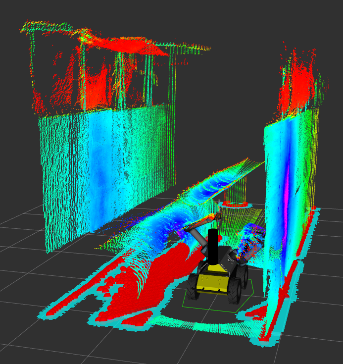

# Table of Contents
1. [Parameter Setup](#parameter-setup)
2. [Use](#use)

***

## About
Laser_Stitcher is a ROS package designed to allow the rotation of a planar LIDAR scanner and stitching of the produced clouds to generate a full-scene 360 degree pointcloud of the environment. The framework is modular with respect to rotary actuation mechanism (so far, UR5 and simple servo interfaces are implemented). The outputs are also highly modular and allow the publication of an arbitrary number of output clouds. Outputs can be postprocessed using the pointcloud library in various ways, can be continuously built up or discarded after each scan, can be saved to bag files automatically, etc. 

This package currently depends on the [pointcloud_processing_server](https://github.com/UTNuclearRobotics/pointcloud_processing_server.git) package, although my intention is to remove this dependency in the long term. It also depends on the pointcloud library and on the laser_geometry packages, although these are included in the ROS distribution. 

## Parameter Setup
Each stitcher platform requires two yaml files to be set up with parameters - one 'basic' and one 'output' file. These are stored in the respective directories within param/

### Basic Yaml File Setup
This file contains all the basic parameters for the stitcher system, excluding just those parameters related to output formats. 

- yaml_file_name: name of the target yaml file for the output data settings
- target_frame: default frame in which to publish clouds (this can be altered on a cloud-by-cloud basis)
- 
- 

### Output Yaml File Setup

## Use
Running the Laser_Stitcher requires running the two primary nodes - the laser_stitcher node itself, and the actuation manager node. This is typically handled by a launch file - an example launch file is included in launch/urscript_manager.launch

Alternatively, these two nodes can just be rosrun separately. If you go this route make sure to load the relevant parameter yaml files with 'rosparam load'. 

Once the two nodes are running, service requests can be sent to the actuation manager node, which handles internal communication with the actual stitcher. Scans can be run once or continuously, depending on input parameters. 